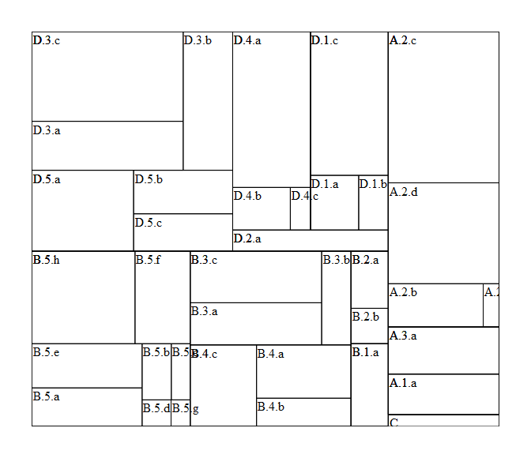
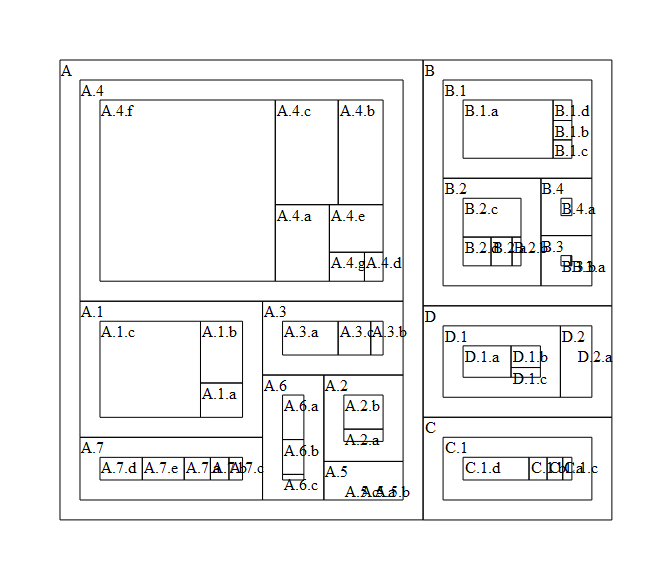
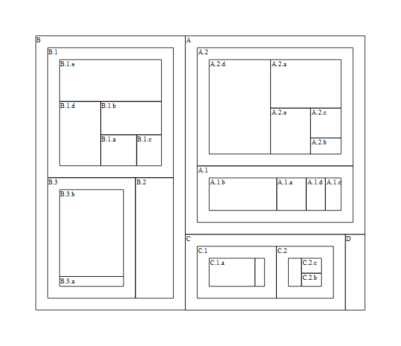

<!-- README.md is generated from README.Rmd. Please edit that file -->
[](https://cran.r-project.org/package=d3hierR)

d3hierR
=======

The goal of `d3hierR` is to provide some foundational `htmlwidgets` for hierachies using [d3](https://d3js.org). I do not know how far I will go with this package.

Installation
------------

You can install `d3hierR` from github with:

``` r
# install.packages("devtools")
devtools::install_github("timelyportfolio/d3hierR")
```

Widgets
-------

Currently, only a treemap is provided in `d3hierR` with the function `tree`.

Example
-------

Here is a quick look at `d3hierR::tree()` with some random hierarchical data.

### Quick Example

``` r
library(treemap)
library(d3r)
library(d3hierR)

rhd <- treemap::random.hierarchical.data()
rhd_nest <- d3r::d3_nest(rhd, value_cols = "x")
#> Warning: package 'bindrcpp' was built under R version 3.4.1

tree(rhd_nest, sizeField = "x")
```



### Tile and Padding Example

``` r
library(treemap)
library(d3r)
library(d3hierR)

rhd <- treemap::random.hierarchical.data()
rhd_nest <- d3r::d3_nest(rhd, value_cols = "x")

tree(
  rhd_nest,
  sizeField = "x",
  paddingOuter = 20,
  tile = htmlwidgets::JS("d3.treemapBinary")
)
```



### "The Labels Are Too Long" Example

The `clipText` argument will use a very simple test to clip any label text that is too wide or high to fit in its rectangle. Also, we can use the `styleText` argument to decrease the font size.

``` r
library(treemap)
library(d3r)
library(d3hierR)

rhd <- treemap::random.hierarchical.data()
rhd_nest <- d3r::d3_nest(rhd, value_cols = "x")

tree(
  rhd_nest,
  sizeField = "x",
  paddingOuter = 20,
  tile = htmlwidgets::JS("d3.treemapBinary"),
  styleText = list("font-size" = "70%"),
  clipText = TRUE
)
```



### More

I built a lot more into it, but out of time for more examples ...

Code of Conduct
---------------

Please note that this project is released with a [Contributor Code of Conduct](CONDUCT.md). By participating in this project you agree to abide by its terms.
